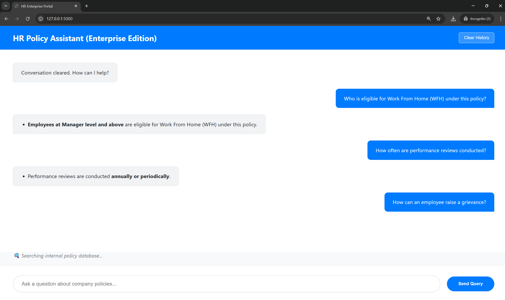

# HR Support Agent (RAG)

An end-to-end AI application that uses **Retrieval-Augmented Generation (RAG)** to answer company policy questions.

### Tech Stack
- **LLM:** Qwen3-4B (Running locally via Ollama)
- **Framework:** Flask (Python)
- **Orchestration:** LangChain (LCEL)
- **Vector Database:** FAISS
- **Embeddings:** HuggingFace (all-MiniLM-L6-v2)

### Features
- **Full-Screen UI:** Professional enterprise-grade interface.
- **Thinking Indicator:** Real-time visual feedback while searching documents.
- **Formatted Responses:** Point-wise answers with bold highlights.
- **Safety Filter:** Only answers questions based on the provided policy documents.

### Setup
1. Install [Ollama](https://ollama.com) and run `ollama pull qwen3:4b`.
2. Clone this repo.
3. Run `pip install -r requirements.txt`.
4. Run `python app.py`.

